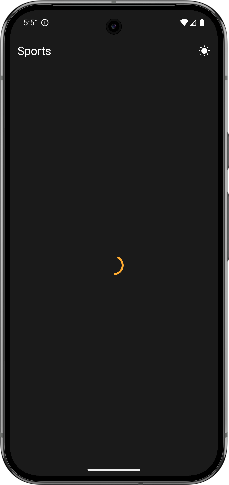
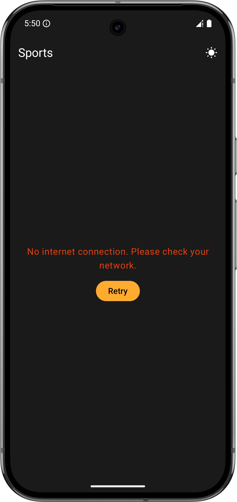

# SportsApp

An Android app that fetches upcoming sports events from a remote API, groups them by sport, and lets users manage favorites — all built with Clean Architecture, MVVM, and a fully modularised Gradle setup.

The remote data is a static JSON file (`docs/sports.json` in this repo) served via GitHub Pages at [`thodorismount.github.io/SportsApp/sports.json`](https://thodorismount.github.io/SportsApp/sports.json).

---

## Screenshots

| Light Theme | Dark Theme |
|:-----------:|:----------:|
|  |  |

The app gracefully handles both loading and error states. A centered loading indicator is shown while data is being fetched, and a descriptive error message with a **Retry** button is presented when the request fails (e.g. no internet connection) — ensuring a smooth user experience in all scenarios.

| Loading State | No Connection |
|:-------------:|:-------------:|
|  |  |

---

## Architecture

The project follows **Clean Architecture** with a strict separation of concerns across layers, combined with an **api/impl module split** that enforces dependency inversion at the Gradle level: only `:app` (the composition root) knows about implementation classes.

```
┌──────────┬─────────────────────────────────────────────────────┐
│          │                  :presentation                      │
│          │       Renders UI · Observes state · Handles events  │
│          ├────────────────────────────┬────────────────────────┤
│   :app   │       :domain:api          │      :domain:impl      │
│          │  Core models & contracts   │  Orchestrates use cases│
│  Compos- ├────────────────────────────┴────────────────────────┤
│  ition   │                   :data                             │
│   Root   │     Combines remote + local into a single repo      │
│          ├─────────────────────────────┬───────────────────────┤
│  Koin DI │       :remote:api           │      :local:api       │
│          │  Fetches sports from API    │  Manages favorites    │
│          ├─────────────────────────────┼───────────────────────┤
│          │       :remote:impl          │      :local:impl      │
│          │  Ktor client · DTOs · maps  │  Room DB · DAOs       │
└──────────┴─────────────────────────────┴───────────────────────┘
```

### Module responsibilities

| Module | Role |
|---|---|
| `:domain:api` | Domain models (`Sport`, `SportEvent`), repository interface, use case interfaces |
| `:domain:impl` | Use case implementations (`GetSportsWithFavoritesUCImpl`, `ToggleFavoriteUCImpl`) |
| `:remote:api` | `SportsApiSource` interface — exposes domain models, hides network details |
| `:remote:impl` | Ktor HTTP client, DTOs, JSON deserialisation, DTO→domain mappers |
| `:local:api` | `LocalFavoritesSource` interface — exposes `Flow<Set<String>>` and `toggleFavorite` |
| `:local:impl` | Room database, `FavoriteEntity`, `FavoriteDao`, source implementation |
| `:data` | `SportsRepositoryImpl` — combines remote and local sources |
| `:presentation` | ViewModel, UI models (`SportModel`, `EventModel`), Compose screens and components |
| `:app` | Koin DI modules, `MainActivity` |

---

## Tech Stack

| Concern | Library |
|---|---|
| UI | Jetpack Compose + Material 3 |
| Architecture | ViewModel + StateFlow |
| Dependency Injection | Koin 4.2 |
| Networking | Ktor 3.4 (Android engine) |
| Serialisation | kotlinx.serialization |
| Local persistence | Room 2.8 |
| Async | Kotlin Coroutines + Flow |
| Testing | JUnit 4, MockK, Turbine, kotlinx-coroutines-test |

---

## Key Features

- **Events grouped by sport** in a `LazyColumn`, each sport in its own collapsible section
- **Favorites** — toggled per event, persisted in Room, observed reactively via `Flow`
- **Countdown timer** — `HH:MM:SS` per event card, driven by a single ticker in the ViewModel updating every second
- **Favorites filter** — per-sport toggle that hides non-favourite events without losing expanded/filter state on data refresh
- **Error & empty states** — dedicated screens with a retry action
- **Dark theme** throughout

---

## Unit Tests

Tests follow a consistent `given / when / then` structure with MockK for mocking and Turbine for Flow assertions. Coverage spans every layer:

| Module | Tests |
|---|---|
| `:domain:impl` | `GetSportsWithFavoritesUCImplTest`, `ToggleFavoriteUCImplTest` |
| `:remote:impl` | `MappersTest` — DTO→domain mapping |
| `:data` | `SportsRepositoryImplTest` — delegation, `runCatching` wrapping |
| `:presentation` | `UiMappersTest` — domain→UI mapping; `SportsViewModelTest` — state transitions |

---

## Extras

### Dark / light theme toggle
A sun/moon icon button in the top app bar lets the user switch between the custom dark and light colour schemes at runtime. The preference is held in `rememberSaveable` in `MainActivity` so it survives rotation. Both schemes use the same brand colours (Gold, PrimaryBlue, AccentRed) with appropriate background and surface adaptations for each mode.

### iOS companion app
A functionally equivalent iOS version of this app was built using **[Claude Code](https://claude.ai/code)** (Anthropic's AI coding CLI) powered by the **Claude Sonnet 4.6** model, to demonstrate AI-assisted development across platforms. As an Android developer with limited Swift or SwiftUI experience, the iOS app was produced entirely through AI pair-programming — same architecture, same features, different platform.

Source: [github.com/thodorismount/SportsAppiOS](https://github.com/thodorismount/SportsAppiOS)

### Sport category icons
Each sport section header displays a sport-specific icon loaded from a vector drawable stored in `res/drawable`. The mapping from API sport ID to icon is handled by the `SportType` enum — each entry's name matches the API sport ID and carries a nullable `@DrawableRes`. An `UNKNOWN` sentinel entry covers unrecognised IDs gracefully (no icon rendered). The mapping lives in `UiMappers.kt` and is fully covered by unit tests.
